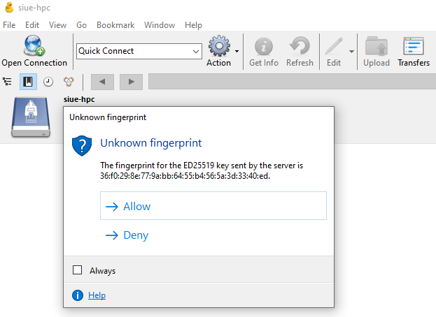
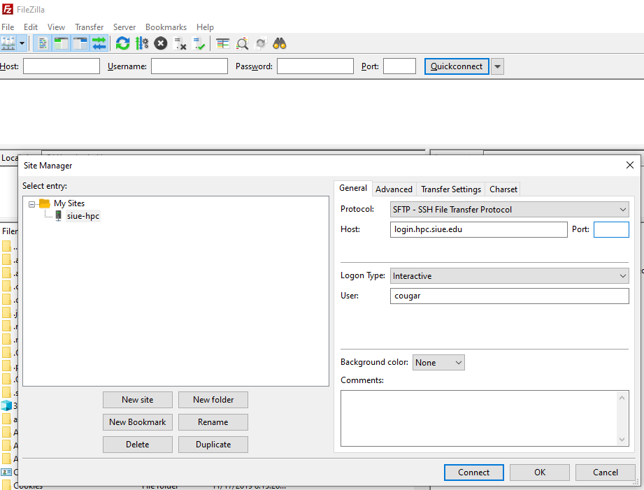
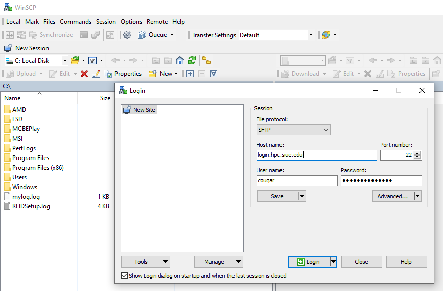
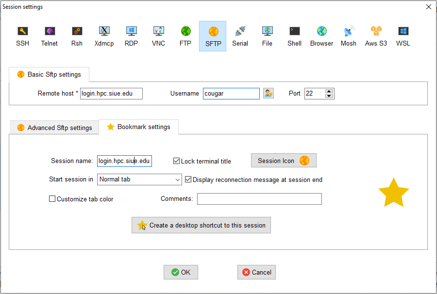
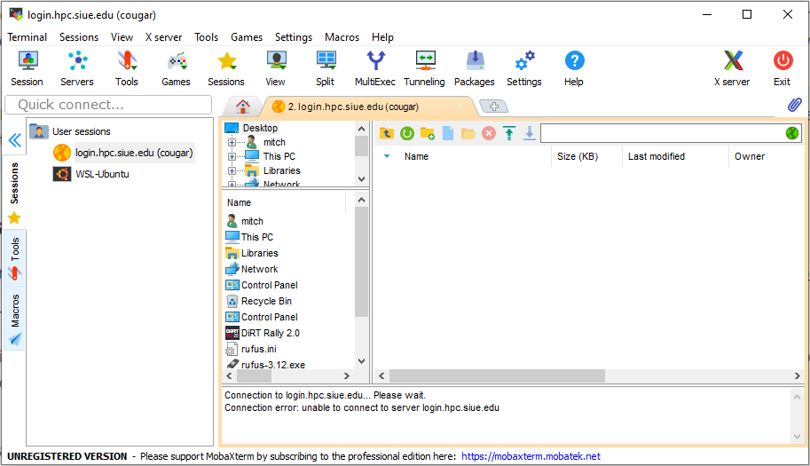

# Transferring Files Using a Graphical User Interface

For many SIUE users, the most convenient way to transfer files between their computer and SIUE systems is to use a GUI (graphical user interface)-based SFTP client. The SFTP client is installed and run on your computer. It works by connecting to the SFTP server running on SIUE systems, enabling you to transfer files back and forth. You can connect to either the main campus cluster login nodes (login.hpc.siue.edu) or, for better performance, the dtn.hpc.siue.edu node, which are dedicated, high-speed data transfer nodes.

You are welcome to use any SFTP client you wish. Cyberduck, FileZilla, WinSCP, and MobaXterm are popular choices. Instructions for using each of these clients to transfer data between your local computer and SIUE systems are described below.

### Cyberduck

You can download Cyberduck from the vendor website at https://cyberduck.io/.

Go to the Bookmark menu and choose New Bookmark. Save these settings:

* Server: login.hpc.siue.edu
* Username: Your SIUE e-ID/username
* (Optional) SSH Private Key: The path to your private key (usually ~/.ssh/id_rsa)

Clicking the red X in the upper right saves your settings. Highlighting the bookmark and pressing Enter on your keyboard will open the connection.

Click Allow to accept the unknown fingerprint, and you will get the login popup.

?> Note: If you encounter connection timeout errors, you can increase the timeout window: Preferences > Connection > Timeouts. Change the "Timeout for opening connections (seconds)" value to 120, for example.

### FileZilla

You can download FileZilla from the vendor website at https://filezilla-project.org.

Make sure to download the FileZilla client, not the FileZilla server. Once the installation is complete, you will need to create a SIUE profile on the client. You can do so by going to the Site Manager and clicking on "New site":

For convenience, you can click the Rename button to name the site something memorable. Apply these settings:

* Protocol: SFTP – SSH File Transfer Protocol
* Host: login.hpc.siue.edu
* Logon Type: Interactive
* User: Your SIUE e-ID/username

After the General tab settings have been filled out, select the Transfer Settings tab:

* Check "Limit number of simultaneous connections"
* Maximum number of connections: 1

These settings will keep a single connection open so you will not have to re-authenticate.

?> Note: If you encounter connection timeout errors, you can increase the timeout window: Edit > Settings > Connection > Timeout. Change the "Timeout in seconds" value to 120, for example.

Verify and accept the fingerprint for the remote node.

Click Connect and the password prompt will pop up. Enter your SIUE e-ID password:

Once the authentication goes through, you will be logged in to your home directory, with your local laptop or PC folders on the left, and your Linux home directory structure on the right.

?> Note: Upon connecting for the first time, you may receive a pop-up asking you to accept a server key. Accept the server key if you encounter this.

### WinSCP

You can download WinSCP from the vendor website at https://winscp.net.

After installing, click on New Session and enter your relevant details. Click Login to continue.

After you are logged in, you will see a drag-and-drop layout with your local system on one side and your Linux directory structure on the other. The tool offers extensive additional functionality for multiple transfers, file synchronizing, and more. Experiment to find your most productive workflow.

?> Note: If you encounter connection timeout errors, you can increase the timeout window: Login Dialog > Advanced... > Connection > Timeouts. Change the "Server response timeout" value to 120, for example.

### MobaXterm
You can download MobaXterm from the vendor website at https://mobaxterm.mobatek.net/download-home-edition.html.

To both transfer and modify (e.g., delete) files, use SFTP with MobaXterm (instead of SCP).

To begin, instead of using SSH, click the "Session" icon on the top left corner (or, Sessions > New Session from the top menu). Click "SFTP" when asked to choose a session type. Enter `dtn.hpc.siue.edu` "Remote Host" and enter your SIUE e-ID as your username. Keep the port as "22". You can choose to save these options as a shortcut under "Bookmark Settings." Lastly, click OK.

)

When successfully entering the SFTP session, your local files will be on the left and your remote SIUE files will be on the right. Use the top left file menu to navigate your local files (displayed underneath), and use the buttons on the top right side to navigate your remote files. Drag and drop between the two menus to copy files between your local computer and SIUE systems. To modify files on SIUE systems, use the buttons at the top.

?> Note: If you encounter connection timeout errors, click the "Settings" icon from the top menu. Then click to the SSH tab and under "SSH Settings", make sure to check "SSH keepalive" and click OK. Restart MobaXterm and try again.
