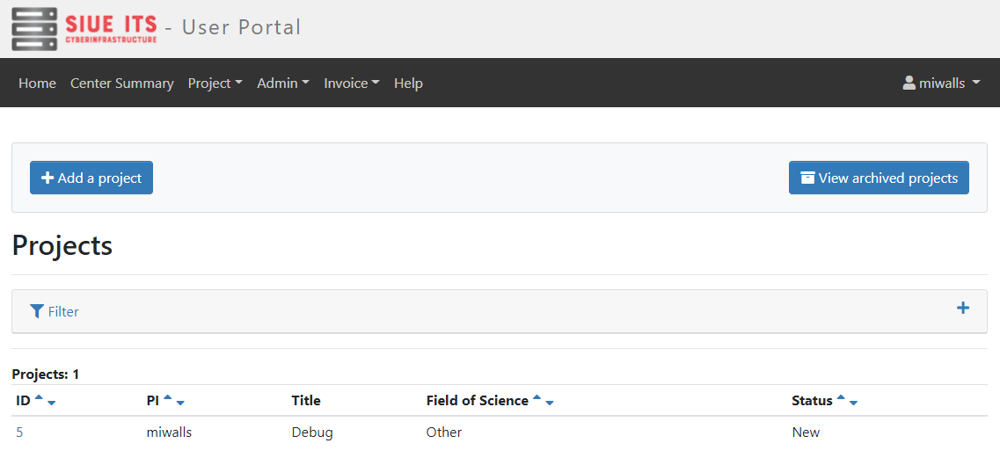

# Create New Project

Each PI should have one project. Some PIs may require additional projects depending on their roles at SIUE. Anyone teaching classes should create a separate project for each course taught, and these projects can be reused each semester. Also, anyone using the cluster for work outside their general research area should create a separate project for that work.

### Creating a new project

To create a new project, click on either the Projects link or the Project menu tab to access the [Projects Page](https://coldfront.hpc.siue.edu/project/).

Click on the "Add a Project" button.

### Project details
Fill out the 4 fields with information about your project:

- **Title**:
  - The title of your project should be concise but descriptive of the work being done. Avoid titles such as "My project" or "Project 1".
- **Description**:
  - The description should include a brief summary of the work that is being done as well as the project's goal.
- **Field of science**:
  - This drop-down list was taken from the National Science Foundation. If your field is not listed, please choose "Other".

<!-- ### Billing information

~!!!!ColdFront Project page

The fields in the Billing section are automatically filled from the billing information associated with your account as a PI. If this information hasn't been added to your account previously, you will need to complete the fields yourself. See the Adding Billing Information user guide for instructions. Billing information must be inputted to create your project, but you will only be billed if your project utilizes paid resources (e.g., project storage in excess of the 1 TB you receive for free).

After inputting billing information, click the "Save" button. -->

### Project Detail page

You will then be able to view all of your project information on the Project Detail page:

Entering your publication and grant information is not required to get started, but this information will be required to be updated on your
[project renewal date each year](user_guides/project_and_allocation_management/yearly_project_renewal.md).

### Additional information

Your next step is to request an allocation to a resource. If you have other researchers working on your project, you can also add users to your project. The guides below will walk you through the next steps of the project creation process.

- [Request New Allocation](user_guides/project_and_allocation_management/request_new_allocation.md)
- [Adding Users](user_guides/project_and_allocation_management/adding_users.md)
- [Granting Manager Access](user_guides/project_and_allocation_management/granting_manager_access.md)
- [Removing Users](user_guides/project_and_allocation_management/removing_users.md)
- [Adding Grant Information](user_guides/project_and_allocation_management/managing_grant_information.md)
- [Adding Publication Information](user_guides/project_and_allocation_management/managing_publication_information.md)
- [Yearly Project Renewal](user_guides/project_and_allocation_management/yearly_project_renewal.md)
